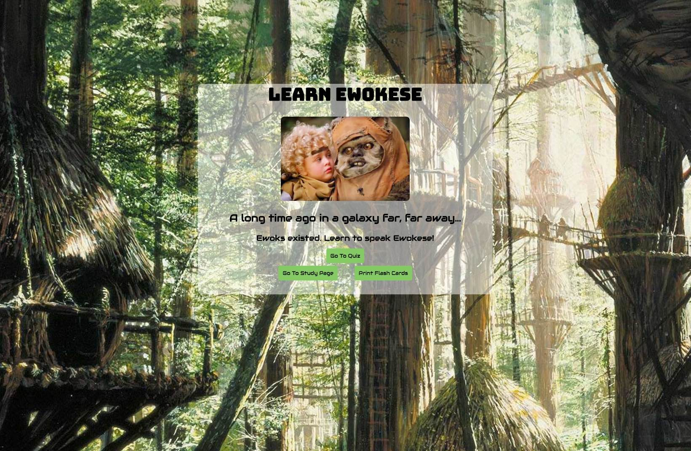

# Ewokese

A long time ago in a galaxy far, far away... Ewoks existed. Use [this app](https://jpke.github.io/spaced-rep-deploy/#/) to brush up on your Ewokese!




## Motivation

This is a demonstration of using a spaced repetition algorithm for learning new content. The idea is to repeatedly review learning material, while basing the repetition frequency of each concept on the number of prior successfull recalls.

Concretely, consider five items to learn, A, B, C, D, E. Each question starts with an mValue of 1.

Item A is reviewed first. A.mValue = 1.
* If the user recalls item A, successfully:
* A.mValue is set to 3
* A is put in ahead in the queue by A.mValue spaces.
  * The queue would now become: B,C,D,A,E
  * If the user recalls A correctly when presented with again:
    * A.mValue is doubled (to 6 in this case)
    * A is put ahead in the queue by A.mValue spaces.
* If the user fails to correctly recall item, A, it is put ahead in the queue by A.mValue spaces.
  * The queue would instead become: B,A,C,D,E
* Item B is assessed next, with the same outcomes possible.
* This process continues as the queue is iterated through.


## Technologies

| **Tech** | **Description** |
|----------|-------|
|  [HTML](https://developer.mozilla.org/en-US/docs/Web/HTML)  |   DOM Elements    |
|  [CSS](https://developer.mozilla.org/en-US/docs/Web/CSS)  |   Styling    |
|  [React](https://facebook.github.io/react/)  |   Javascript framework for single page apps   |
|  [Redux](http://redux.js.org/)  |   Application state management for react    |
|  [Google OAuth 2.0](https://developers.google.com/identity/protocols/OAuth2)  |   Authentication   |
|  [Express](http://expressjs.com/)  |   Server framework for Node   |
|  [MongoDB](https://www.mongodb.com/)  |   No-SQL database    |


## API Reference
#### The server code can be found [here](https://github.com/jpke/spaced-rep-express)

* GET /auth/google   :: initial OAuth2 request
* GET /auth/google/callback  :: successful OAuth2 redirects here, which returns access token to user
* GET /question      :: returns first quiz question of page quiz session for user
* PUT /question      :: accepts user response to question
  * if correct, increases question mValue
  * if incorrect mValue remains unchanged
  * question placed in approprite bin of queue
  * quesetion at top of queue returned
* POST /demo/user :: creates new demo user and returns demo id
* GET /demo/question :: returns first quiz question to demo user
* PUT /demo/question :: accepts demo user response to question
  * if correct, increases question mValue
  * if incorrect mValue remains unchanged
  * question placed in approprite bin of queue
  * quesetion at top of queue returned


## Use

* To use [this app](https://jpke.github.io/spaced-rep-deploy/#/) authenticate through Google, or `Skip Login` to play in demo mode. The redirect for authenticating through Google may take a few seconds since the app server is on a free heroku dyno that may need to wake up.
* To develop on this app's frontend, make sure you have node and npm [installed](https://docs.npmjs.com/getting-started/installing-node), then simply clone the repo and run:

 ```
 npm install
 ```

 * This was built with [create-react-app](https://github.com/facebookincubator/create-react-app). To start the development server, type:

 ```
 npm start
 ```

 * Note, you will need to change `const URL` in src/actions.js and `const AURH_URL` in src/Landing.js to [http://localhost:3090](http://localhost:3090) in order to develop locally.

* To modify the backend, see the [app's express server](https://github.com/jpke/spaced-rep-express).


##
##### Contributers
* bsoung
* dennellmarie
* jpke
